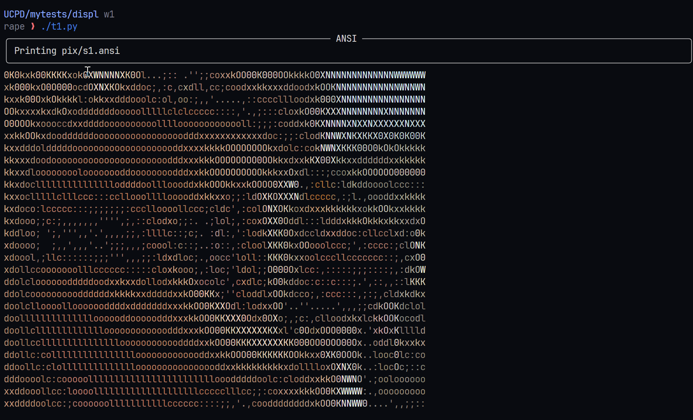

# Disp1 

> Testing out the python [requests](https://requests.readthedocs.io/en/latest/) , package which is standard for _http_ requests . This will be running lick and suck tests 

# Code 

```py
import requests as r

url = 'https://snips.sh/f/Tv2OQSoagn?r=1'

response = r.get(url)
print(response.text)
```

## Output 



